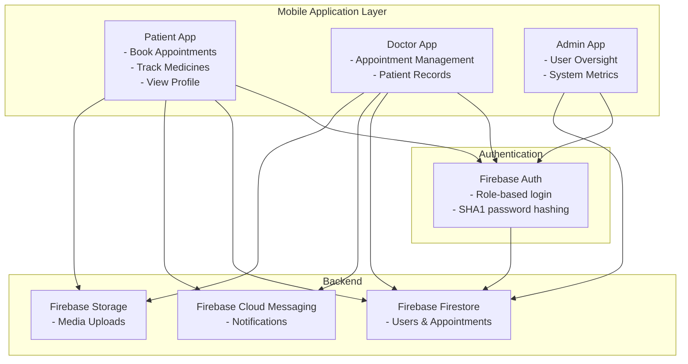
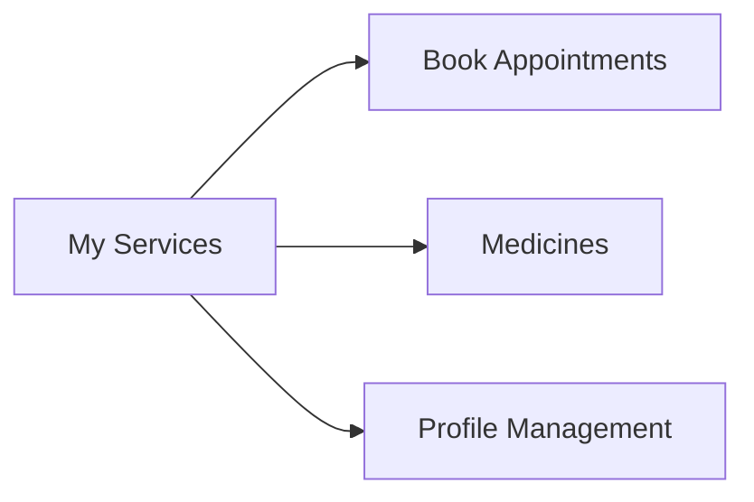
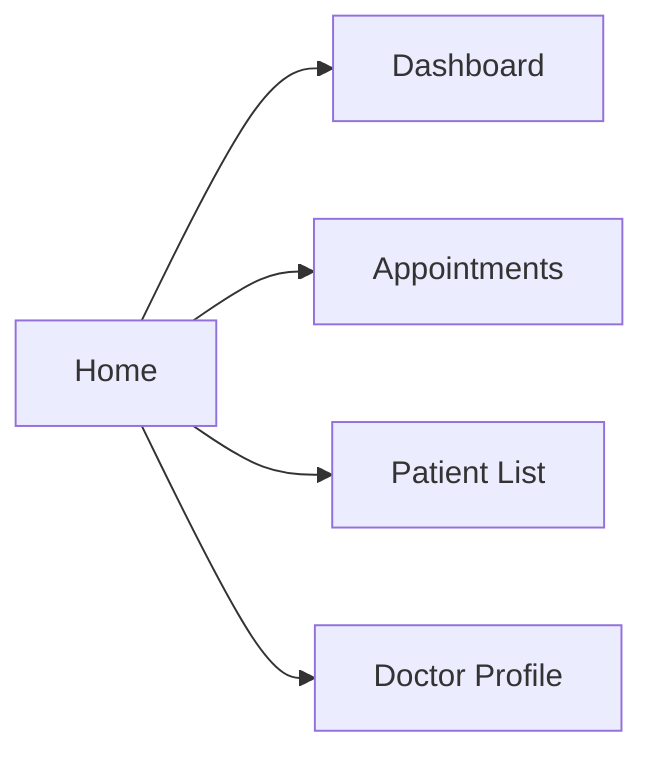
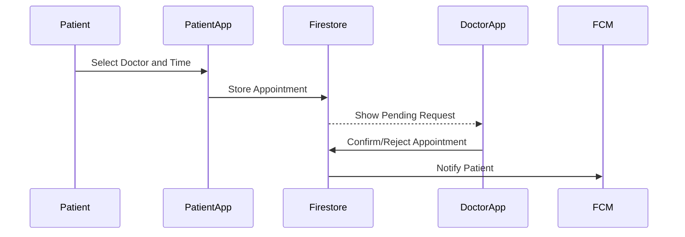

<div align="center">

# Hospital Management System (HMS) - Mobile Application

**Student:** Afifa Faisal
**Registration No:** 22MDSWE215
**University:** University of Engineering & Technology, Mardan
**Department:** Computer Software Engineering
**Assignment:** #4 - Mobile Application Development
**Semester:** Spring 2025 (6th)
</div>
---

## 🩺 Problem Statement

Traditional hospital workflows rely on inefficient manual systems for appointment booking, patient record tracking, and communication between doctors and patients. This project addresses these issues by developing a secure, role-based mobile application that connects patients, doctors, and admin staff using Firebase services for real-time updates, cloud storage, and authentication.

---

## 📲 System Overview

This cross-platform Flutter application supports **three user roles** with distinct interfaces:

* **🧑‍⚕️ Doctor**
* **🧑‍💼 Admin**
* **👨‍🔬 Patient**

Each role offers a custom UI, functionality, and backend interactions powered by Firebase.

---

## 🏗️ System Architecture



---

## 🔐 Authentication System

* **Phone-based Registration & Login**
* **SHA1 Password Hashing for Secure Storage**
* **Role Selection Flow**
* **Firebase Authentication Integration**

---

## 🧑‍💼 Admin Interface (Future Phase or Web Portal)

> *Although not present in the current mobile app codebase, this module can be extended as part of future development.*

* Monitor patient and doctor registrations
* View usage statistics and logs
* Control over access and approval

---

## 👨‍🔬 Patient Interface

### 🧭 Navigation Structure



### Key Features

* 📅 **Appointment Booking**
  Browse available doctors by specialization and book appointments.

* 💊 **Medicines**
  View catalog, order medicine, and track prescription updates.

* 🧾 **Profile Management**
  Update personal info, manage profile picture, toggle dark/light mode.

* 🔔 **Notifications**
  Real-time appointment status and doctor updates via FCM.

* 💾 **Local + Cloud Data Sync**
  Uses SharedPreferences for offline access and Firestore for cloud sync.

---

## 🧑‍⚕️ Doctor Interface

### 🧭 Navigation Structure



### Key Features

* 📊 **Dashboard**
  View patient count, welcome message, and quick stats.

* 🗓️ **Appointments**
  See upcoming appointments, accept/reject bookings, and manage time slots.

* 👨‍👩‍👧‍👦 **Patient List**
  Search patients, view records, add new notes/appointments.

* 🧾 **Doctor Profile**
  Upload profile image, edit personal info, adjust notification settings.

* 📢 **Push Notifications**
  Automatically notify patients of appointment updates via FCM.

---

## 🔁 Appointment Lifecycle



---

## 🧠 State Management

* ✅ **Provider Pattern**
* 🔄 **SharedPreferences**: Offline data
* ☁️ **Cloud Sync**: Real-time updates with Firestore
* 🖼️ **Firebase Storage**: Profile picture uploads

---

## 🧰 Technology Stack

| Feature          | Technology               |
| ---------------- | ------------------------ |
| Frontend         | Flutter (Dart)           |
| Backend          | Firebase Firestore       |
| Authentication   | Firebase Auth            |
| Notifications    | Firebase Cloud Messaging |
| Storage          | Firebase Storage         |
| State Management | Provider Pattern         |
| Offline Support  | SharedPreferences        |

---

## 📁 Project Structure

```
lib/
├── main.dart                         # App entry point
├── registration/
│   ├── registration.dart             # Role selector
│   ├── patient_registration.dart     # Patient auth
│   └── doctor_registration/
│       ├── doctor_registration_new.dart
│       └── doctor_provider.dart
├── doctor/
│   ├── doctor_home.dart
│   └── doctor_profile.dart
├── patient/
│   ├── patient_home.dart
│   └── profile.dart
└── themes/
    └── provider.dart
```

---

## 🔐 Security Features

* Role-based access control
* SHA1 password hashing
* Firebase Firestore rules for read/write operations
* Input validation & sanitization

---

## 🚀 Installation & Setup

### 1. Clone Repository

```bash
git clone https://github.com/afifa_faisal/mad_hms.git
cd mad_hms
```

### 2. Install Dependencies

```bash
flutter pub get
```

### 3. Firebase Setup

* Add `google-services.json` (Android)
* Add `GoogleService-Info.plist` (iOS)
* Configure Firestore rules and FCM

### 4. Run App

```bash
flutter run
```

---

## 📈 Future Enhancements

* [ ] Google Calendar integration
* [ ] Telemedicine/video calling
* [ ] Admin web panel for user management
* [ ] Real-time patient-doctor chat
* [ ] Multi-language support
* [ ] Electronic health records

---

## 🧪 Complex Engineering Attributes

✅ Addressed **conflicting requirements** between real-time data, offline mode, and usability
✅ Implemented **depth of analysis** in role-based architecture
✅ Demonstrated **technical knowledge** with Firebase & state management
✅ Tackled **novel challenges** like offline sync + real-time notifications
✅ Considered **stakeholder diversity** with different roles
✅ Ensured **interdependent systems** work together seamlessly

---

## 📌 Notes

This project reflects a full-fledged mobile HMS with real-world scope. The patient and doctor modules are functional, and an admin layer can be added. Firebase backend services ensure scalability, while the Provider-based state management keeps the app reactive and fast.

> The application is assignment-compliant and scalable for production-grade use with proper architectural separation.

